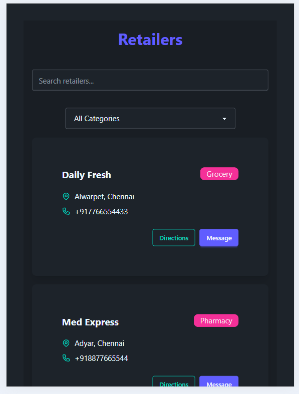

# 🛍️ Retailer Listing UI

A sleek and responsive web application for listing retailers with category filtering and search functionality. Built using **React**, **TailwindCSS**, and **Zustand** for state management. Deployed on **Vercel**.

🌐 Live Site: [https://retailers.vercel.app](https://retailers.vercel.app)
## 📸 Preview



---

## ✨ Features

- 🔍 **Search Retailers** — Find retailers by name with a smooth, debounced search input.
- 🗂️ **Category Filter** — Instantly filter retailers by category.
- 📱 **Responsive Design** — Works seamlessly across devices.
- ⚡ **Fast State Management** — Powered by Zustand for efficient reactivity.
- 🎨 **Modern UI** — Clean and minimal interface with TailwindCSS.

---

## 🛠️ Tech Stack

- **Frontend**: [React](https://reactjs.org/), [TailwindCSS](https://tailwindcss.com/)
- **State Management**: [Zustand](https://zustand-demo.pmnd.rs/)
- **Deployment**: [Vercel](https://vercel.com/)

---

## 🚀 Getting Started

### Prerequisites

- Node.js (v16 or higher)
- npm or yarn

### Installation

```bash
git clone https://github.com/your-username/retailer-listing-ui.git
cd retailer-listing-ui
npm install
# or
yarn install
